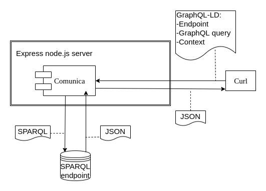

# Comunica API
This repository sets up a simply node.js server that can query a sparql endpoint with a graphql query and will send back JSON results. The graphql to sparql and handling of the SPARQL query is done by software written by Ruben Taelman: https://www.npmjs.com/package/graphql-ld-comunica

## Installation

Prerequisites: make sure that node.js and yarn are installed. For Debian/Ubuntu the following should work.

```
$ sudo apt-get update
$ sudo apt-get install nodejs

$ curl -sS https://dl.yarnpkg.com/debian/pubkey.gpg | sudo apt-key add -
$ echo "deb https://dl.yarnpkg.com/debian/ stable main" | sudo tee /etc/apt/sources.list.d/yarn.list

$ sudo apt update && sudo apt install yarn
```

After cloning the repository run `yarn` in the directory

In order to be able to send a query and specify the endpoint, we need to start the server with

`yarn run server`

Afterwards, the server is available at `localhost:3000`. The server can be sent a curl post request which needs an endpoint, a query and a context.

At the moment we assume that the application or user using the api will have knowledge of the linked data namespace though this could be mitigated by providing a graphql schema.

## Example use

Let us take a look at an example to see how it can be used. We are going to use a registry of the Dutch cadastre (Kadaster) to demonstrate the functionality. There is a public endpoint available at

`https://api.labs.kadaster.nl/datasets/kadaster/bag/services/bag/sparql`

As an example we are going to send the following graphql query:

```graphql
{
  identificatiecode @single
  bagstatus(label_nl: "Pand in gebruik (status pand)") @single
}
```
We need a context for this to work:

```json
{
    "@context": {
      "label_nl": { "@id": "http://www.w3.org/2000/01/rdf-schema#label", "@language": "nl" },
      "bagstatus": "http://bag.basisregistraties.overheid.nl/def/bag#status",
      "identificatiecode":"http://bag.basisregistraties.overheid.nl/def/bag#identificatiecode"
    }
  }
```
This query is equivalent to the following SPARQL query:

```sparql
PREFIX bag: <http://bag.basisregistraties.overheid.nl/def/bag#>
PREFIX rdfs: <http://www.w3.org/2000/01/rdf-schema#>
SELECT distinct ?o WHERE {
   ?s rdf:type ?o;
     bag:status [rdfs:label "Pand in gebruik (status pand)"@nl ].
}
```
After starting the server, you can run the query and save the result to an output file with the following line of code:

`curl -X POST localhost:3000 -H "Content-type: application/json" -d @example_args.json > output.json`


## The context

We can represent the architecture of the express server shell around Comunica as follows:



In the current implementation we used Curl to send a json with the GrapQL-LD format to our server with the Comunica module. We use the variation which uses a SPARQL endpoint, but it should have been possible to query directly on Linked Data Fragments (LDF) using Comunica as well (UPDATE 13 February: this has now been implemented!). This would be an interesting next step, as it would not require a SPARQL service to be present (and consuming memory) in order to query the data with GraphQL


#### Work in progress -the example's schema and its SHACL representation
For this example we can define a GraphQl schema and a SHACL shape that gives the corresponding representation that can be helpful in resolving JSON-LD

```GraphQl
type Bagpand(identificatiecode: String!) {
  bagstatus {
      label_nl: String!
  }
}
```

```SHACL
ex:Bagpand a sh:NodeShape;
  graphql:uriTemplate "http://bag.basisregistraties.overheid.nl/def/bag#identificatiecode{$identificatiecode}";
  sh:property [
    graphql:name "identificatiecode"
    sh:minCount 1;
    sh:maxCount 1;
    sh:datatype xsd:string;
  ];
.
ex:bagstatus a sh:NodeShape;
  graphql:uriTemplate "http://bag.basisregistraties.overheid.nl/def/bag#bagstatus{$label_nl}";
  sh:property [
    graphql:name "label_nl"
    sh:minCount 1;
    sh:maxCount 1;
    sh:datatype xsd:string;
  ];
  .
```
