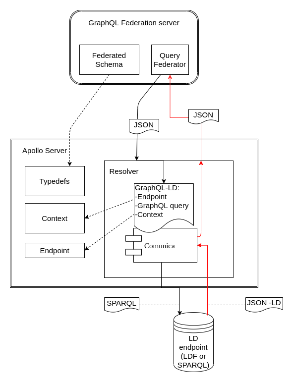

# Goal architecture for Federation with LD sources

In this document we describe the suggested solution for creating an _introspectable_ GraphQL-LD solution that can be used in federated schemas.
What we would like is an endpoint where we only have to define (i.e. set/configure):

- TypeDefs: effectively the GraphQL schema
  - It is a requirement that we need to be able to use the extend keyword to extend other data sources.
- Context: the interpretation of the schema in terms the semantics from the Linked Data
- Endpoint: the Linked Data source

The idea is that we, as GraphQL 'developer's with knowledge about Linked Data, do not have to worry about the resolvers anymore, as we would like to use Comunica for this purpose.

### Gap

In the [current implementation](https://github.com/kadaster/data-science-team/tree/master/Comunica-Apollo-Federation-Example), we use a separate Comunica-Api that was previously implemented. However, this part should be simplified: the resolver(s) could use Comunica directly to adress a Linked Data source. Moreover, we now have a resolver that is not generic. The whole resolving should be handeled by Comunica, with minimal extension. The resolver should make use of the context and Endpoint defined elsewhere in the configuration of this specific server. The introspection specification is discussed [here](https://github.com/kadaster/data-science-team/tree/master/Comunica-Apollo-Federation-Example/Introspection). In points:

- Integrate Comunica in Apollo framework setup
- Make one generic resolver
  - which uses the context and endpoint specified

### Future work (out of scope)

Ideally, we would like to generate a schema (typedefs) automatically, based on a Linked Data source.
