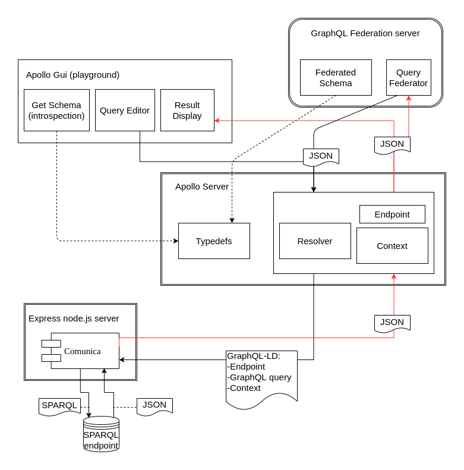

# Comunica-Apollo Federation example
This repository makes use of the earlier set-up from https://github.com/kadaster/data-science-team/tree/master/Comunica-Api. In this continuation we set up an Apollo graphql endpoint which makes use of the Comunica embedded server from the Comunica-API code.

## Installation

Prerequisites: make sure the [Comunica-API](https://github.com/kadaster/data-science-team/tree/master/Comunica-Api) is running by running `yarn server` in the correct folder. The API will be available at `localhost:3000`

After cloning this repository run `yarn` in the directory. In order to expose the GraphQL endpoint and also start the GUI run:

`yarn run dev`

Afterwards, GUI playground of Apollo is available at `localhost:3500/graphql`. You will notice that in this GUI you can write and send queries to our endpoint, but you can also inspect the Schema and 'Docs' by clicking the buttons on the right hand side. The Schema and Docs are extracted by Apollo from the type and query definitions.

## Example use

As an example we give two queries to enter in the GUI. In the first Any BRT *gebouw* Identifier can be filled in here and it will return the identification code(s) and BAG status(us) of the related BAG *panden*.

```graphql
{
  getBagFromBrt(brtId: "100011425"){
    identificatiecode
    bagstatus
  }
}
```

For the second, a BAG *pand* identifier is entered as an argument and it will return the BRT label. Also it will return the related BAG *panden* i.e. at least the one that we entered as an argument, and possibly more.


```graphql
{
  getBrtFromBag(bagId: "0717100000002852"){
    label
    gerelateerdBAGpand{
      identificatiecode
    }
  }
}
```

#Context

The purpose of this repository is to construct a graphql endpoint that can be used in a federated schema that can resolve to a linked data source. In the previously mentioned [Comunica-API](https://github.com/kadaster/data-science-team/tree/master/Comunica-Api) repository we set up the bottom part of the picture: an express server to which graphql-ld queries can be send and which returns a JSON with the response. In order to be part of a federated schema, however, we need to be able to send an introspect query to the endpoint which shows how it connects to other data sources.

For this purpose we have set up a Apollo server where we write type definitions and a resolver part which has a piece of hard coded context and an endpoint in order to be able to send a GraphQL-LD query to the comunica API. On the top right we see a GraphQL Federation server which would need to send the introspection query to read the Typedefs from the endpoint. It could also send queries and expect a response in JSON.

In the code in this repository we allow Apollo to start a playground, a GUI which has functionality to write and send queries and display the result. It also inspects the schema and generates docs with introspection queries. For this it uses the Typedefs on our Apollo server. The paths of sending a query are shown using black arrows, whereas the returning results are indicated in red arrows (for visual clarity - the red does not imply any faulty results in this case).

The final goal was to extend a schema on a GrapQL Federation server. It was demonstrated separately (outside the scope of this repository), that indeed it was possible to extend a federated schema (also using Apollo as federation server). This was achieved by adding the extend type to our typeDefs. Again, the Apollo federation server must have fetched the schema with introspection queries.




## Further steps

It would be great if we could write a generic resolver that only needs to paste the query which we send to the Apollo graphql endpoint (conform the type definition specification). This way we only need to add a stable context and endpoint for all the possible queries specified in the Typedefs to be valid. For this perhaps some changes need to be made to the Comunica module or a more sophisticated resolver has to be written.

Furthermore, It would be really nice if we could return a JSON-LD format. This way, a user would be able to turn the result back into triples. The current implementations does rely heavily on Apollo, and it may have a limitation that it cannot deal with JSON-LD properly.

## Update 13 february
Implemented Comunica over HDT queryEngine: we can now use Linked Data Fragments to query on. Changed the endpoint to the fragments endpoint.
